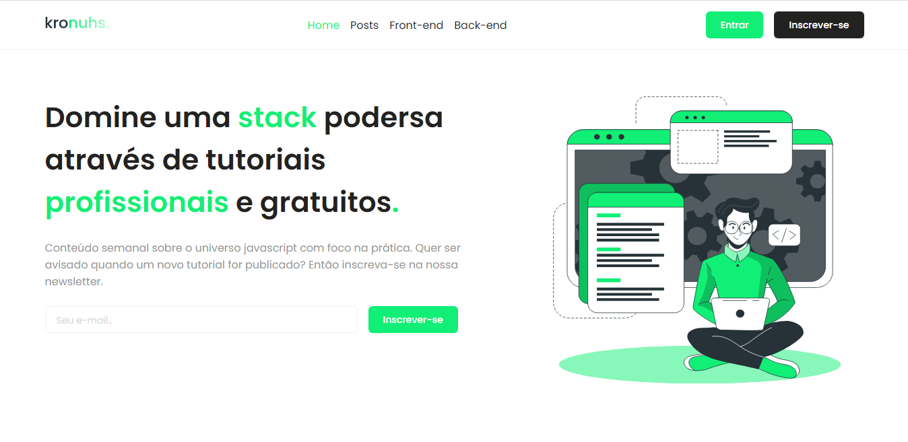

<div align="center">
  
  <h3>Blog desenvolvido com as tecnologias mais modernas do momento.</h3>
</div>

## 📃 Sobre

<br />

O Blog **kronuhs** foi desenvolvido tendo como foco utilizar tecnologias atuais como next.js, axios e muito mais.

Esta aplicação permite o leitor interagir por meio de likes e comentários, além de possuir um sistema de authenticação jwt e newsletter.

## 💻 Principais Tecnologias utilizadas no projeto

Este projeto utiliza diversas tecnologias bem legais e úteis que você talvez possa gostar e utilizar em alguns projetos.

- [React](https://pt-br.reactjs.org/)
- [Next.js](https://nextjs.org/docs)
- [Typescript](https://www.typescriptlang.org/)
- [Date-fns](https://date-fns.org/)
- [Markdown-to-jsx](https://www.npmjs.com/package/markdown-to-jsx)
- [Nookies](https://www.npmjs.com/package/nookies)
- [Phosphor-icons](https://phosphoricons.com/)
- [React-hot-toast](https://react-hot-toast.com/)
- [React-modal](https://www.npmjs.com/package/react-modal)
- [Sass](https://sass-lang.com/)
- [Swiper](https://swiperjs.com/react)

## Funcionalidades

Este projeto possui diversas funcionalidades úteis em um blog que você pode conferir logo abaixo:

- Criação de conta para leitores.

- Sistema de contagem de views

- Sistema de likes

- Sistema de comentário

- Páginação de postagens

- Inscrição em newsletter

- Atualização de imagem de perfil

## Como executar o projeto na sua máquina

<br />

Para executar o projeto você terá de seguir os passos listados abaixo. 

Primeiro clone o repositório do projeto com o comando:

<br />

```bash
git clone git@github.com:henrique998/kronuhs-web.git
```

Execute um dos comando abaixo para instalar as dependências do projeto:

```bash
npm install
# OU
yarn install
```

<br />

Agora está tudo pronto para iniciar o projeto. execute o comando abaixo para iniciar o servidor:

<br />

```bash
npm run dev
# OU
yarn dev
```

## Aviso

<br />

**Primeiro**: Lembre-se de clonar a api abaixo, instalar as depências e iniciar o servidor. você pode conferir mais detalhes em: 

- [Kronuhs-api](https://github.com/henrique998/kronuhs-api)

**Segundo**: Este frontend web está atrelado a dois projetos no total, uma api (citada no passo anterior) e um painel de gestão, escrito também em [Next.js](https://nextjs.org/docs)

Você pode encontrar o painel de gestão em:

- [Kronuhs-dashboard](https://github.com/henrique998/kronuhs-dashbord)

## Contato

<br />

Entre em contato comigo por email ou no linkedin:

- henriquemonteiro037@gmail.com
- [linkedin](https://www.linkedin.com/in/henrique-monteiro1/)